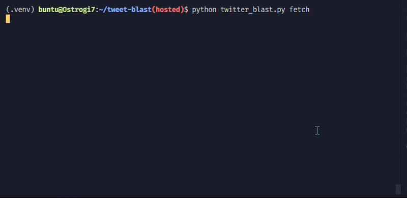
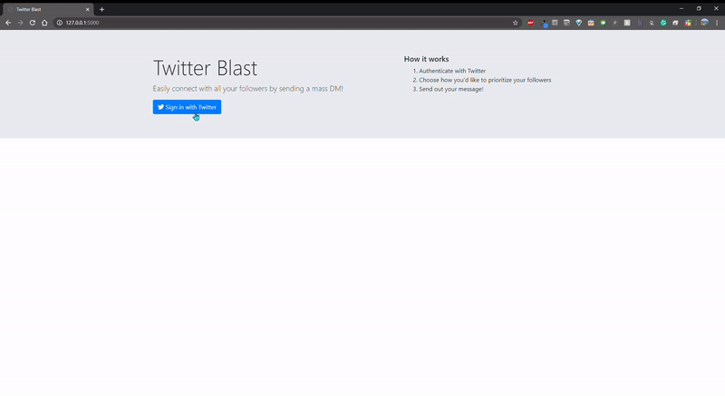

# Twitter Blast(CLI/Flask versions)

Mass DM tool for Twitter to convert followers to another platform

Solution to: https://github.com/balajis/twitter-export/

[](https://buildkite.com/drizzle/twitter-blast)
[](https://codecov.io/gh/drizzleco/twitter-blast)

### CLI Version



### Flask Version



# Features

- easy authentication using Sign in with Twitter
- preview follower rankings before sending the real deal
- defaults to dry run mode to prevent unintentionally sending out DMs
- remembers when a DM has been sent to a follower so no unintentional double sends
- automatically pauses execution to wait out rate limits

# Getting Started(CLI version)

1. `make install` to install dependencies
2. Edit `secrets.py`(automatically created) in the same directory as `twitter_blast.py` and add your app credentials:

   - make sure your Twitter app has "Read, write, and Direct Messages" permission

   ```python
    HOSTED_CONSUMER_KEY = "" # for the flask app
    HOSTED_CONSUMER_SECRET = "" # for the flask app
    CONSUMER_KEY = "" # for the CLI version
    CONSUMER_SECRET = "" # for the CLI version
    SECRET_KEY = ""
   ```

3. On first run, you'll be prompted to authorize with Twitter
   ```
    $ python twitter_blast.py
    Visit to authorize with twitter:  https://api.twitter.com/oauth/authorize?oauth_token=_______________________
    Paste the verification code here: ________
   ```
4. `python twitter_blast.py fetch` to fetch your followers
5. `python twitter_blast.py preview` to test out the ranking system and see how your followers will be prioritized
6. `python twitter_blast.py send` to dry send a DM to your followers(add `--real` to send them for real!)

# Getting Started(Flask version)

1. Complete steps 1 and 2 from above.
2. Add `http://127.0.0.1:5000` to your callback URLs in Twitter dev app settings
3. `make start`

   **OR**

3) `source .venv/bin/activate && python app.py`

   **OR**

3. `docker-compose up --build`

# Usage(CLI version)

```
Usage: twitter_blast.py [OPTIONS] [send|fetch|preview|reset|delete_keys]

  Mass DM tool for Twitter to convert followers to another platform

Options:
  --real  Actually send DMs.
  --help  Show this message and exit.
```

### Actions

- ### `fetch`
  - download followers to a local database
    ```
    $ python twitter_blast.py fetch
    Logged in as: SuperTweeter123
    You've already fetched your followers. Are you sure you want to refetch them? This could take a while. [y/n]: y
    Fetching 50 followers
    Fetching follower ids!
    Fetching user objects from ids!
    Fetching 50/50 Followers |██████████████████████████████████████████████████| 100.0% Fetched
    Done!
    ```

* ### `preview`

  - show a preview of followers with specified ranking
  - these preview options are available for ranking your followers

    - recent - prioritize follower who most recently followed you
    - followers_count - prioritize followers with more followers
    - following_count - prioritize followers following more people
    - statuses_count - prioritize followers who have more tweets
    - listed_count - prioritize followers who appear in more lists
    - favourites_count - prioritize followers who have liked more tweets(British spelling cuz thats how twitter does it lol)
    - location - filter followers based on their location
    - description - filter followers based on their bio description

  - good for getting an idea of the follower prioritized by `send`

    ```
    $ python twitter_blast.py preview
    Logged in as: SuperTweeter123
    Choose how you'd like to rank your followers:
    1) recent
    2) followers_count
    3) following_count
    4) statuses_count
    5) listed_count
    6) favourites_count
    7) location
    8) description
    Enter the number of your choice: 2
    ```

  - filtering by location or description will prompt you to enter a string to search for

    ```
    $ python twitter_blast.py preview
    Logged in as: SuperTweeter123
    Choose how you'd like to rank your followers:
    1) recent
    2) followers_count
    3) following_count
    4) statuses_count
    5) listed_count
    6) favourites_count
    7) location
    8) description
    Enter the number of your choice: 7
    Enter what you want to look for in location: cali
    ```

  - opens in less(or your preferred pager) for easy navigation
    ```
    Order of followers to be DM'ed(ranked by followers_count ). Followers whom a DM hasn't been sent are shown:
    nokia
    FundingTweets
    MonsterFunder
    MonsterFunders
    Motts
    StartUpsSolar
    Money360
    abcstoreshawaii
    3DMCTweets
    gaaplug
    datezoholeg
    DSeviorINC
    PrinceSpeaks247
    HelpCrowdfund1
    FizzyDaysMovie
    MoneyTeddyBear
    hollywoodville
    :
    ```

* ### `send`

  - initiate sending mass DM to followers
  - defaults to dry run so no DMs are sent out for real
  - add `--real` to send DMs for real

    ```
    $ python twitter_blast.py send
    Logged in as: SuperTweeter123
    Choose how you'd like to rank your followers:
    1) recent
    2) followers_count
    3) following_count
    4) statuses_count
    5) listed_count
    6) favourites_count
    7) location
    8) description
    Enter the number of your choice: 1

    NOTE: you may want to preview your followers rankings before sending
    What do you wanna say? Type your message below:
    hello world
    Here is your message one more time:

    hello world

    Are you sure you want to send this? [y/n]: y

    Dry run is ON. Messages are not actually being sent. Phew. Add the --real flag to send DMs
    Sending message to 50 followers
    Sending DM to EgoAthletics
    |██████████████████████████████████████████████████| 100.0% Sent
    ```

* ### `reset`
  - resets every followers' DM sent flags, so another mass DM can be initiated
    ```
    $ python twitter_blast.py reset
    Logged in as: SuperTweeter123
    Followers DM sent flags reset!
    ```
* ### `delete_keys`

  - delete API keys stored from authentication

    ```
    $ python twitter_blast.py reset
    Logged in as: SuperTweeter123
    Keys deleted!
    ```

# Behind the Scenes

- Fetching followers data
  - fetches ids of followers first using `followers/ids`
    - `followers/ids` returns 5,000 user ids/request(max 15 requests every 15 minutes )
    - TOTAL: 75,000 users every 15 minutes
  - then, fetches user object using `users/lookup`
    - `users/lookup` can get 100 user objects per request
    - with user-level auth, you can make 900 requests every 15 minutes
    - TOTAL: 90,000 users every 15 minutes
- Ranking Followers
  - uses SQLAlchemy database queries to do the heavy lifting
- Sending DMs
  - uses tweepy's wrapper for `direct_messages/events/new (message_create)`
  - updates database to keep track of which followers have been sent DMs
